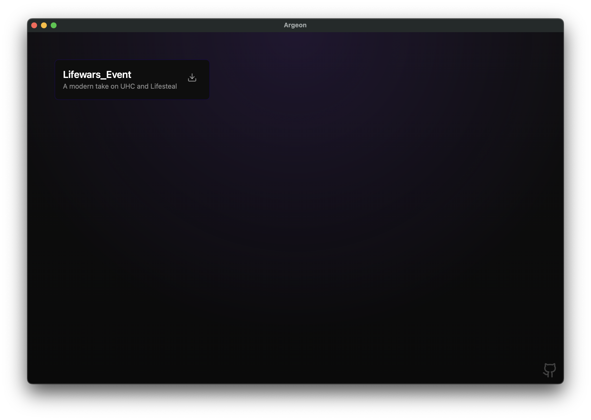
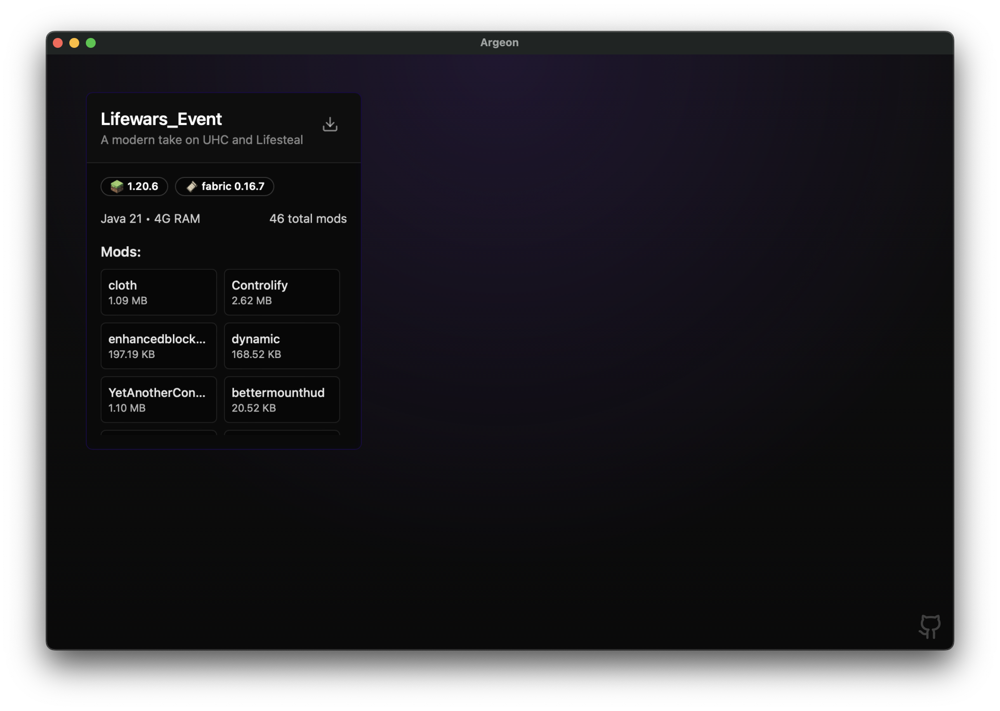
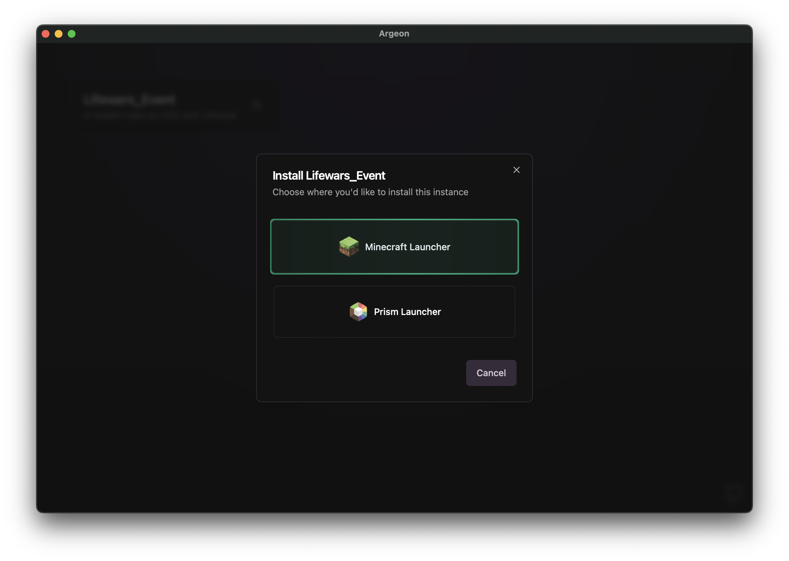
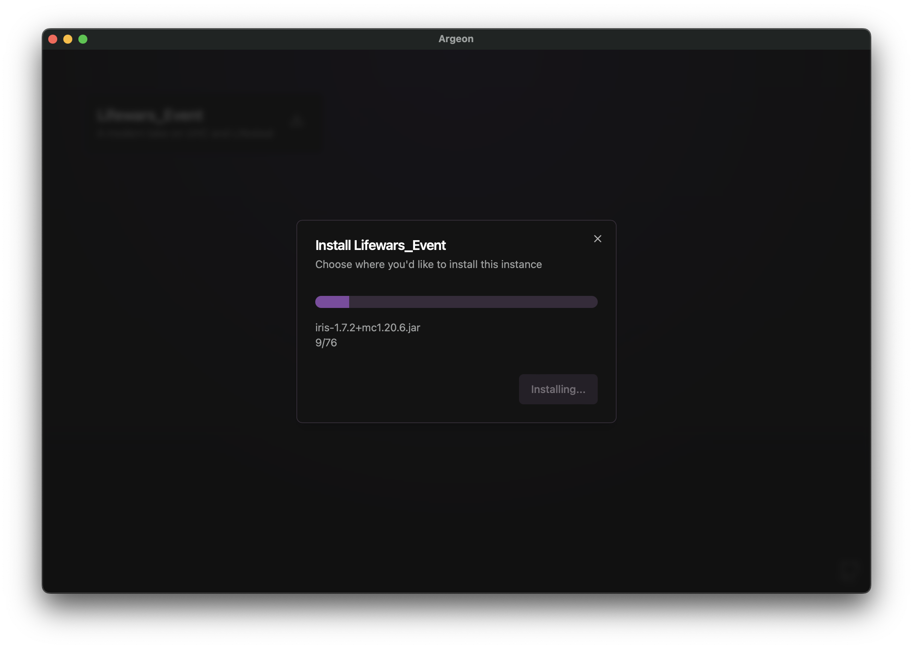

# Argeon

<div align="center">
    
</div>

---


[](https://discord.gg/MWHgn8VNZT)

Argeon (ar-gay-on) is a lightweight instance downloader for [PrismLauncher](https://prismlauncher.org) and the **official Minecraft launcher**. It makes downloading instances for Events, Servers, etc... easier for inexperienced users. This project must be used along with the [Argeon backend panel](https://github.com) (used to manage installable instances)

The latest version is available on the [Releases](https://github.com/Communivents/argeon/releases/latest) page. For more recent builds, see the [nightly releases](https://nightly.link/Communivents/argeon/workflows/build/main?preview).

## Features

- Downloading Minecraft instances (mods, configs, resourcepacks, etc...) to the correct folders
- Supports the official Minecraft launcher and PrismLauncher
- Cross-platform and lightweight (~2MB of storage and ~30-50MB of RAM)
- Launch installed instances directly from the app
- Everything is managed on the backend, the user only has to open the app and press 2 buttons.

## Development

Setting up the Argeon development environment:

1. Clone the repository
2. Execute `npm install`
3. Install additional dependencies:
    ```bash
    # Windows
    winget install NSIS.NSIS

    # MacOS
    brew install nsis

    # Linux
    sudo apt-get install nsis
    ```

Development commands:
- `npm run dev`: Start the development environment
- `npm run build`: Build and package the application

Argeon is built using [Svelte](https://svelte.dev) for the frontend and [NeutralinoJS](https://neutralino.js.org) for the backend. NeutralinoJS is a lightweight C++ alternative to Electron or NW.JS, suitable for cross-platform applications. More information is available at [neutralino.js.org/docs](https://neutralino.js.org/docs).

## Contributing

Contributions are welcome. Please feel free to submit issues, pull requests, or discuss ideas. For further discussion, contact `contact@origaming.ch` or reach out on Discord `@Origaming`.

## Gallery

<div float="left">
    
    
    
    
</div>
